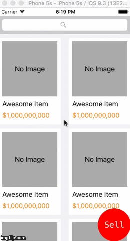
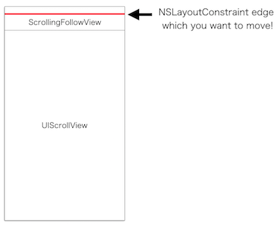

# ScrollingFollowView

[](https://developer.apple.com/iphone/index.action)
[](https://developer.apple.com/swift)

ScrollingFollowView is a simple view which follows UIScrollView scrolling.

#### ScrollingFollowView Sample Images
- SearchBarSample    : SearchBar Area
- ProfileViewSample  : Like Profile View Area
- BottomButtonSample : SearchBar and Bottom Button Area




## Installation
### CocoaPods
ScrollingFollowView is available through [CocoaPods](http://cocoapods.org). To install it simply add the following line to your Podfile:

```
pod "ScrollingFollowView"
```

Then you can import it with:

```
import ScrollingFollowView
```

## How to Use
### Layout InterfaceBuilder
ScrollingFollowView only supports Autolayout use. 
(I don't force this feature on library users. I'm going to modify this feature. Plz look Future Improvements.)
You must make layouts with InterfaceBuilder like under sample image.




### Code
```swift
@IBOutlet weak var scrollingFollowView: ScrollingFollowView!

// NSLayoutConstraint of moving edge.
@IBOutlet weak var constraint: NSLayoutConstraint!

override func viewDidLoad() {
    super.viewDidLoad()

    // First setup
    scrollingFollowView.setup(constraint: constraint, isIncludingStatusBarHeight: true)
}
```

```swift
func scrollViewDidScroll(scrollView: UIScrollView) {
	// scrollingFollowView follows UIScrollView scrolling.
    scrollingFollowView.didScrolled(scrollView)
}
```

## Advanced Use
### Use show(animated:) and hide(animated:)
You can use `show(animated:)` and `hide(animated:)` methods to ScrollingFollowView object like these:

```swift
// show
@IBAction func showButton() {
	scrollingFollowView.show(true)
	scrollingFollowView.resetPreviousPoint(scrollView)
}
// hide
@IBAction func hideButton() {
	scrollingFollowView.hide(false)
	scrollingFollowView.resetPreviousPoint(scrollView)
}
```

`resetPreviousPoint(scrollView:)` must call after `show(animated:)` and `hide(animated)`, `previousPoint` is ScrollingFollowView's private property which used changing constraint.constant value.

And show and hide methods are declared as:
```swift
func show(animated: Bool, duration: Double = 0.2, completionHandler: (()->())? = nil)
func hide(animated: Bool, duration: Double = 0.2, completionHandler: (()->())? = nil)
```

so you can set `animation duration` and `completionHandler` which used after animation:

```swift
// show
@IBAction func showButton() {
	scrollingFollowView.show(true, duration: 0.6) { print("showed") }
	scrollingFollowView.resetPreviousPoint(scrollView)
}
// hide
@IBAction func hideButton() {
	scrollingFollowView.hide(true, duration: 0.5) { print("hid") }
	scrollingFollowView.resetPreviousPoint(scrollView)
}
```

## Runtime Requirements

- iOS8.0 or later
- Xcode 7.0

## Future Improvements
- Refactoring.💪
- Enable to use like UITabBarController.
- Enable to implement only using code.
- Enable to move ScrollingFollowView using frame layout.
- Implement `show()` and `hide()` method.
- Enable to manage previousePoint.
- Enable to horizontally move ScrollingFollowView.

## Contact
When you have some opinions or ideas about this library, send me a reply on Twitter.🍣
[@ktanaka117](https://twitter.com/ktanaka117)

## License
ScrollingFollowView is released under the MIT license. Go read the LICENSE file for more information.